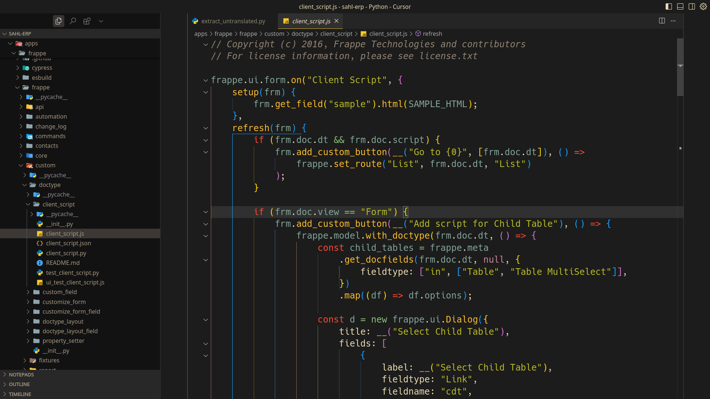
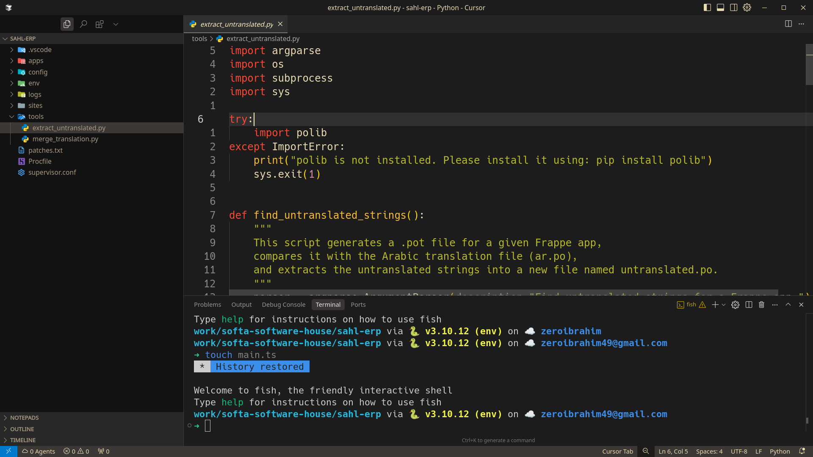
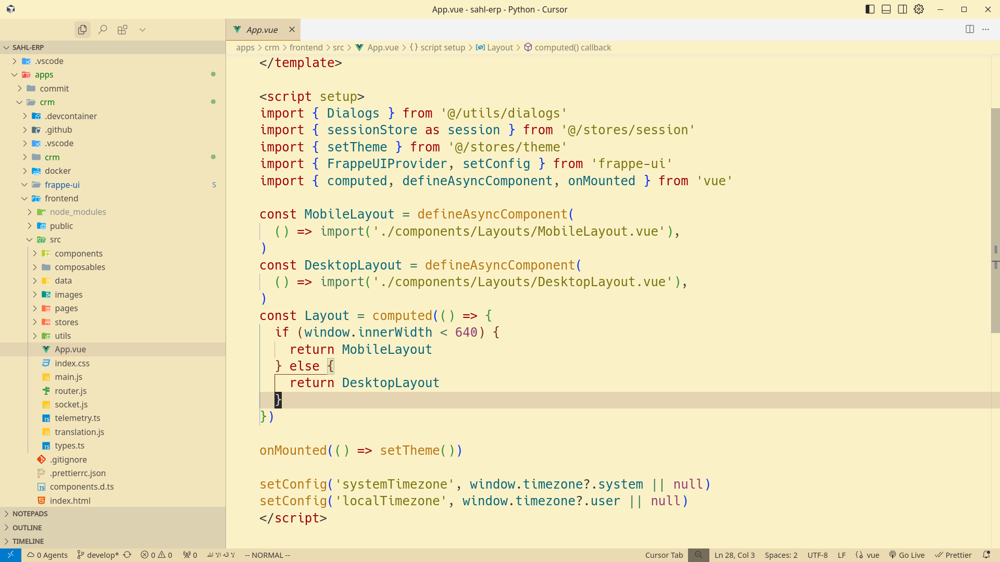
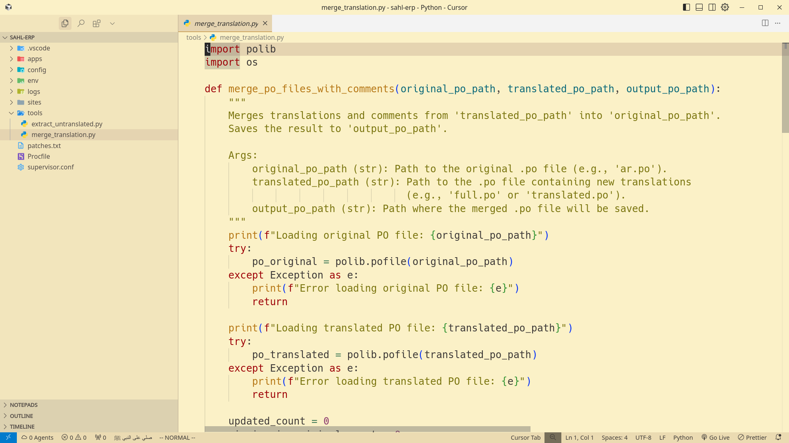

<h1 align="center">🎨 Retrobox for VS Code</h1>

A vibrant and nostalgic VS Code theme inspired by the built-in <code>retrobox</code> colorscheme in Neovim.

  
  
  

---

## ✨ Features

-   **✌️ Two Variants:** A dark theme for focused coding sessions and a light theme for bright environments.
-   **🎨 Rich & Nostalgic Colors:** A carefully selected color palette that is easy on the eyes and inspired by retro aesthetics.
-   **✅ Prominent Syntax Highlighting:** Clear and consistent highlighting for a wide range of languages.
-   **💡 Neovim Inspired:** Brings the beloved `retrobox` feel from Neovim to your VS Code editor.

---

## 📸 Screenshots

### 🌙 Dark Theme

| JavaScript                               | Python                               |
| ---------------------------------------- | ------------------------------------ |
|  |  |

### ☀️ Light Theme

| Vue                                   | Python                                     |
| ------------------------------------- | ------------------------------------------ |
|  |  |

---

## 🎨 Color Palette

### Retrobox Dark

| Color   | Hex       | Usage Description      |
| ------- | --------- | ---------------------- |
| `#1c1c1c` | `ebdbb2`  | Background, Foreground |
| `#fb4934` | `fabd2f`  | Keywords, Functions    |
| `#b8bb26` | `83a598`  | Strings, Variables     |
| `#d3869b` | `8ec07c`  | Numbers, Operators     |
| `#928374` | `458588`  | Comments, Selections   |

### Retrobox Light

| Color   | Hex       | Usage Description      |
| ------- | --------- | ---------------------- |
| `#fbf1c7` | `3c3836`  | Background, Foreground |
| `#9d0006` | `b57614`  | Keywords, Functions    |
| `#79740e` | `076678`  | Strings, Variables     |
| `#8f3f71` | `427b58`  | Numbers, Operators     |
| `#928374` | `bdae93`  | Comments, Selections   |

---

## 🚀 Installation

1.  Open the **Extensions** sidebar in VS Code (`Ctrl+Shift+X` or `Cmd+Shift+X`).
2.  Search for **"Retrobox"**.
3.  Click the **Install** button.
4.  Open the Command Palette (`Ctrl+Shift+P` or `Cmd+Shift+P`) and type `Color Theme`.
5.  Select **`Retrobox Dark`** or **`Retrobox Light`** from the list.

---

## 💖 Contributing

Found a bug or have a suggestion? Contributions are welcome! Please open an issue or submit a pull request.

## 📜 License

This project is licensed under the [MIT License](./LICENSE).
